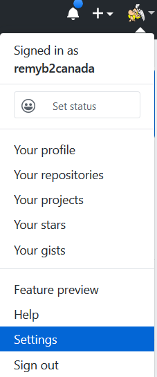
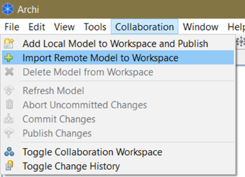
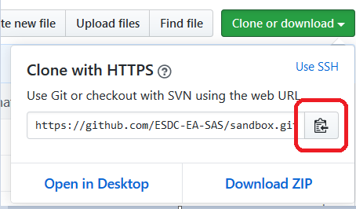
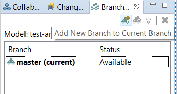
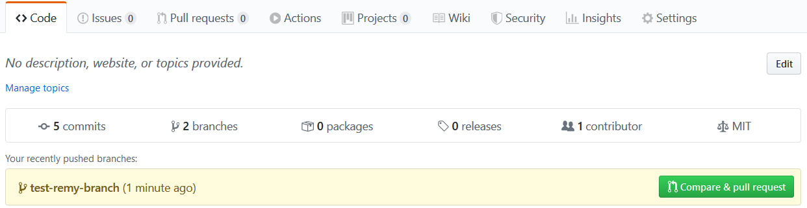
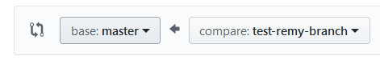
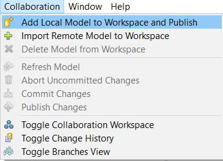

# Procedures and Guidelines for distributed Archi Modeling collaboration <!-- omit in toc -->

The following are procedures and guidelines that contributors to the same Archi models should follow.

- [Procedures](#procedures)
  - [Setting your Github account security settings (optional)](#setting-your-github-account-security-settings-optional)
  - [Contributing to an existing model](#contributing-to-an-existing-model)
    - [Retrieving the exsting model](#retrieving-the-exsting-model)
    - [Making modifications to the existing model](#making-modifications-to-the-existing-model)
  - [Creating a new model and publishing it here](#creating-a-new-model-and-publishing-it-here)
- [Guidelines](#guidelines)
- [Behind the scene information](#behind-the-scene-information)

## Procedures

### Setting your Github account security settings (optional)

If you've [enabled two-factor authentcation](https://help.github.com/en/github/authenticating-to-github/configuring-two-factor-authentication) on your GitHub account, you will need to perform [some extra steps](https://help.github.com/en/github/authenticating-to-github/creating-a-personal-access-token-for-the-command-line) in configuring Archi to communicate with GitHub repositories.

1. Login in GitHub from a web browser and go in your Account Settings

2. Scrolldown to "Developer settings"
3. Select "Personal access tokens"
4. Click "Generate new token"
5. Enter any name for it (note) and in the Scope options, select the following:
   1. repo:
   2. write:packages
   3. read:packages
   4. delete:packages
6. Click "Generate token"
7. **Copy your newly generated token somewhere!** (e.g. in a [KeyPass](https://keepass.info/) encrypted file)

_this token now serves as your Github account password when in Archi_

### Contributing to an existing model

#### Retrieving the exsting model

1. Ensure you have both **read** and **write** [access to the GitHub remote repository](https://help.github.com/en/github/setting-up-and-managing-organizations-and-teams/repository-permission-levels-for-an-organization).
2. Open Archi
3. Select "Collaboration &gt; Import Remote Model to Workspace"

4. In the dialogue, enter the remote Git repository URL (it will end with ".git"), and your Github username and password

_Note_: The easiest way to get the Git repository URL is to go on GitHub wiht your browser, select the green "Clone and download" button, and the copy to clipboard link

5. The model is now in your local Archi workspace for you to work on

#### Making modifications to the existing model

1. Create a new branch (this is necessary to initiate a pull request at the end): "Collaboration &gt; Toggle Branches View"
2. Click on "Add new Branch to Current Branch" icon

3. Give it a unique name and click "Add Branch &nbsp; Checkout". Read [here](https://git-scm.com/book/en/v2/Git-Branching-Branches-in-a-Nutshell) to know more what's happenign now

4. Make any modifications on the model. Saving it as you please (CTRL+S)
5. When you're ready to publish on the remote GitHub server, click "Collaboration &nbsp; Publish Changes"

_Note_: This will perform a [commit](https://www.git-tower.com/learn/git/commands/git-commit) if there is any outstanding changes that have not been committed.

6. Login on the GitHub website and go to the [GitHub repo](https://github.com/ESDC-EA-SAS/sandbox) where you pushed your branch. You will see a message about your newly pushed branch that includes your changes.

7. Click "Compare &nbsp; pull request". Add any details to communicate with your pears the changes you made.

You are comparing the base branch (master) to the new branch (the one you've just pushed).

8. Click "Create pull request"

_Note_: Now your peers can go in the "Pull request" section of GitHub and review the changes you've made before they are merged to the "master" branch.

### Creating a new model and publishing it here

1. [Create a new GitHub repository](https://help.github.com/en/github/getting-started-with-github/create-a-repo) for this new model
2. Open Archi and create a new model. You may save it anywhere on your computer
3. When you're ready to publish it to the team's Github remote repository, select "Collaboration &gt; Add Local Model to Workspace and Publish"

This will actually copy your local model, wherever it was on your PC, to a special Archi folder. From now on, ignore the original location of your local model, Archi will handle the rest.

4. In the dialogue, enter the remote Git repository URL (it will end with ".git"), and your Github username and password

_Note_: The easiest way to get the Git repository URL is to go on GitHub wiht your browser, select the green "Clone and download" button, and the copy to clipboard link

5. 

6. Going forward for this model, you will need to open it from the Archi's workspace, _NOT_ from your local file that you've created at step \#2. To view your model in Archi's workspace, select "Collaboration &gt; Toggle Collaboration Workspace". You will see a list of models in your Archi workspace.

## Guidelines

Various guidelines contributors should use to enhance collaboration and reduce frictions between the teams
